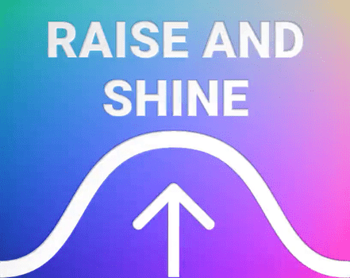
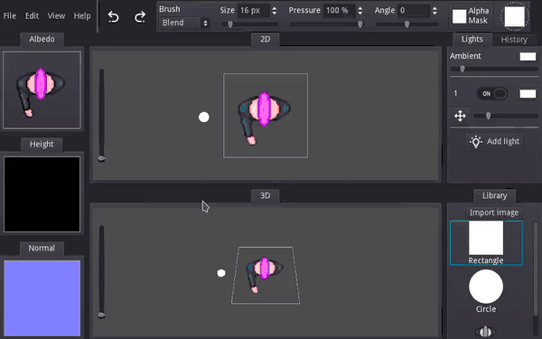
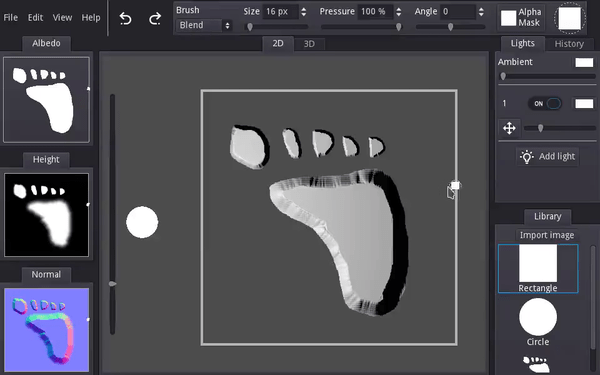
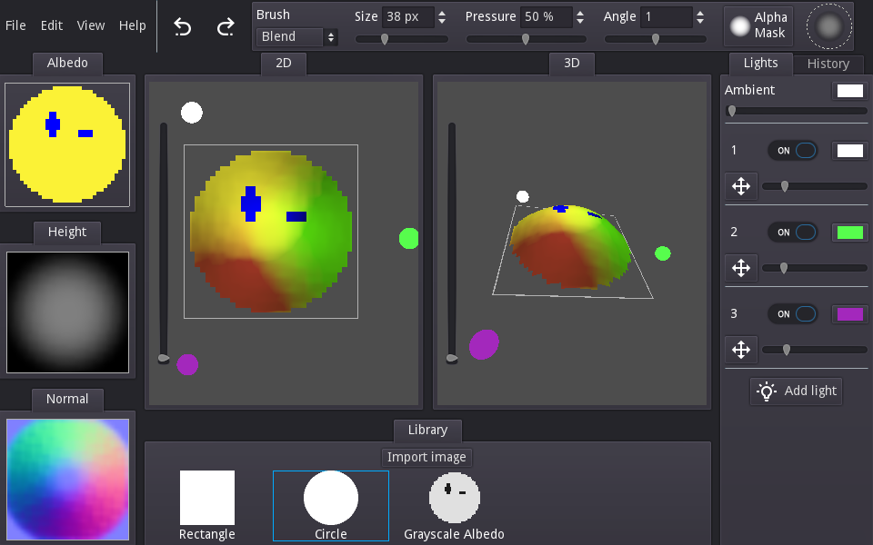

# 
Height map editor with automatic Normal map generation for 2D textures.

It counts with a 3D visualization of the height and dynamic lighting preview,
making it super easy to create normal maps!

Made with [Godot](https://godotengine.org/), currently on open beta!
Run it on you browser: https://gilzoide.itch.io/raise-and-shine

### Credits
- **P1_2** texture from Heayale Heale: https://github.com/Artars/HeayaleHeale
- Several icons from Material Design Icons: https://github.com/Templarian/MaterialDesign
- **Noto Sans** font by Google: https://www.fontspace.com/noto-sans-font-f22281
- **Roboto** font by Christian Robertson: https://fonts.google.com/specimen/Roboto
