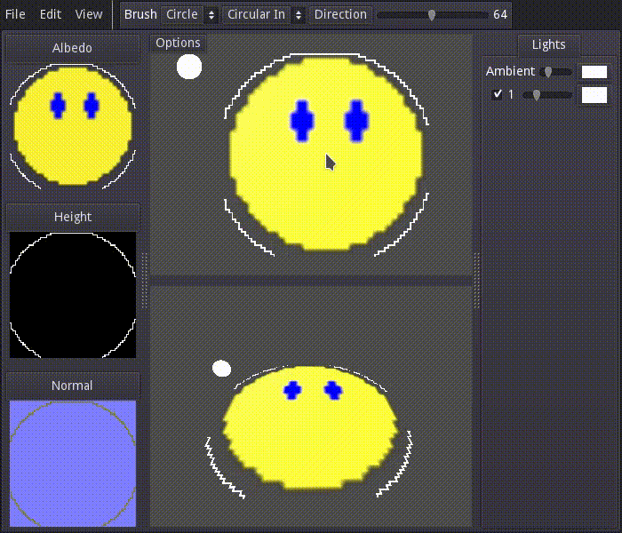

# Raise and Shine
Height map editor with automatic Normal map generation for 2D textures.

It counts with a 3D visualization of the height and dynamic lighting preview,
making it super easy to create normal maps.

Made with [Godot](https://godotengine.org/), to be launched soon!

### Credits
- P1_2 texture from Heayale Heale: https://github.com/Artars/HeayaleHeale
- Undo, Redo, Context Menu icons from Material Design Icons: https://github.com/Templarian/MaterialDesign
